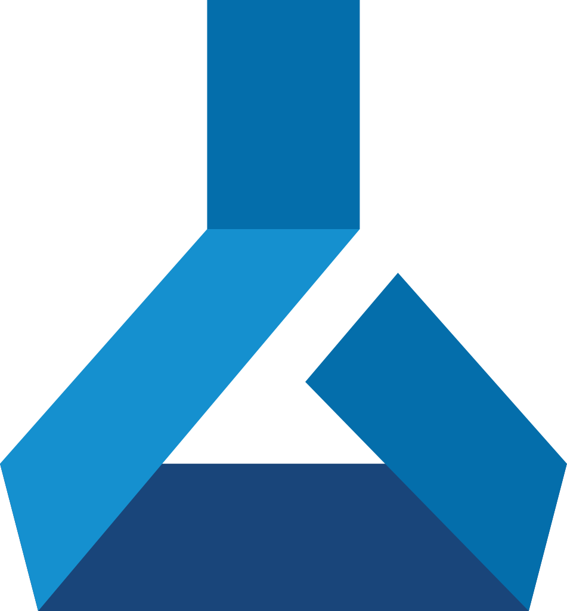

## Repository under Customisation
This is an adapted version of MLOps template.

#### ML Ops with GitHub Actions and Azure Machine Learning

  
  
  

This template can be used for easily setting up a data science or machine learning project with automated training and deployment using [GitHub Actions](https://github.com/features/actions) and [Azure Machine Learning](https://docs.microsoft.com/en-us/azure/machine-learning/). For a more comprehensive version of this automated pipeline, see the [aml-template](https://github.com/Azure/aml-template) repository.

#### Contributing

This project welcomes contributions and suggestions.  Most contributions require you to agree to a
Contributor License Agreement (CLA) declaring that you have the right to, and actually do, grant us
the rights to use your contribution. For details, visit https://cla.opensource.microsoft.com.

When you submit a pull request, a CLA bot will automatically determine whether you need to provide
a CLA and decorate the PR appropriately (e.g., status check, comment). Simply follow the instructions
provided by the bot. You will only need to do this once across all repos using our CLA.

This project has adopted the [Microsoft Open Source Code of Conduct](https://opensource.microsoft.com/codeofconduct/).
For more information see the [Code of Conduct FAQ](https://opensource.microsoft.com/codeofconduct/faq/) or
contact [opencode@microsoft.com](mailto:opencode@microsoft.com) with any additional questions or comments.

